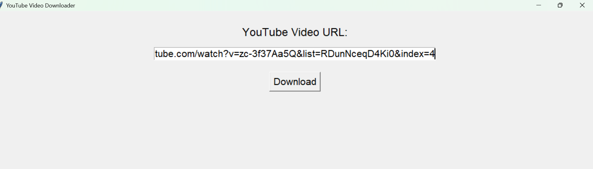

# YouTube Video Downloader



## Overview

The **YouTube Video Downloader** is a Python application that allows users to download YouTube videos seamlessly through a user-friendly graphical interface. Built using the `pytube` library, this tool ensures quick and easy video downloads directly to your local machine.

## Features

- **Simple GUI**: User-friendly interface built with Tkinter.
- **High Compatibility**: Supports downloading videos in MP4 format.
- **Ease of Use**: Download videos by simply pasting the YouTube URL.
- **Custom Download Directory**: Choose where to save your videos.

## Screenshot


## Prerequisites

Ensure you have the following installed:

- [Python 3.x](https://www.python.org/downloads/)
- [pytube](https://pytube.io/en/latest/)

Install the required Python libraries using pip:

```sh
pip install pytube tkinter
```

## Usage

1. **Clone the repository:**

    ```sh
    git clone https://github.com/inayatrahimdev/youtube-video_downloader.git
    cd youtube-video_downloader
    ```

2. **Run the application:**

    ```sh
    python youtube_downloader.py
    ```

3. **Download a video:**

    - Paste the YouTube video URL into the text entry field.
    - Click the "Download" button.
    - Choose the directory where you want to save the video.
    - The video will be downloaded to the chosen directory.

## Code Overview

### Main Functionality

- **Download Video**: Validates and downloads the video from the provided URL.
- **GUI**: Built using Tkinter to provide a simple interface for users.

```python
from pytube import YouTube
import re
import tkinter as tk
from tkinter import filedialog, messagebox

def download_video(url, output_path='./'):
    try:
        video_id_match = re.match(r'(?:https?:\/\/)?(?:www\.)?youtube\.com\/watch\?v=([a-zA-Z0-9_-]+)', url)
        if video_id_match:
            video_id = video_id_match.group(1)
            yt = YouTube(f"https://www.youtube.com/watch?v={video_id}")
            video = yt.streams.filter(file_extension='mp4').first()
            if video:
                video.download(output_path)
                return f"Downloaded: {yt.title}"
            else:
                return "No MP4 video format available for download."
        else:
            return "Invalid YouTube URL format. Please provide a valid URL."
    except Exception as e:
        return f"Error downloading video: {str(e)}"

def download_button_action():
    url = url_entry.get()
    output_path = filedialog.askdirectory()
    if output_path:
        result = download_video(url, output_path)
        messagebox.showinfo("Download Status", result)

def main():
    root = tk.Tk()
    root.title("YouTube Video Downloader")
    root.state('zoomed')
    
    frame = tk.Frame(root)
    frame.pack(expand=True, fill=tk.BOTH, padx=20, pady=20)
    
    tk.Label(frame, text="YouTube Video URL:", font=('Helvetica', 18)).pack(pady=10)
    
    global url_entry
    url_entry = tk.Entry(frame, width=50, font=('Helvetica', 16))
    url_entry.pack(pady=5)
    
    download_button = tk.Button(frame, text="Download", command=download_button_action, font=('Helvetica', 16))
    download_button.pack(pady=20)
    
    root.mainloop()

if __name__ == "__main__":
    main()
```

## Contribution

Contributions are welcome! Please feel free to submit a Pull Request.

## License

This project is licensed under the MIT License.

## Contact

For any inquiries or feedback, please reach out to [inayatrahim006@gmail.com](mailto:inayatrahim006@gmail.com).
